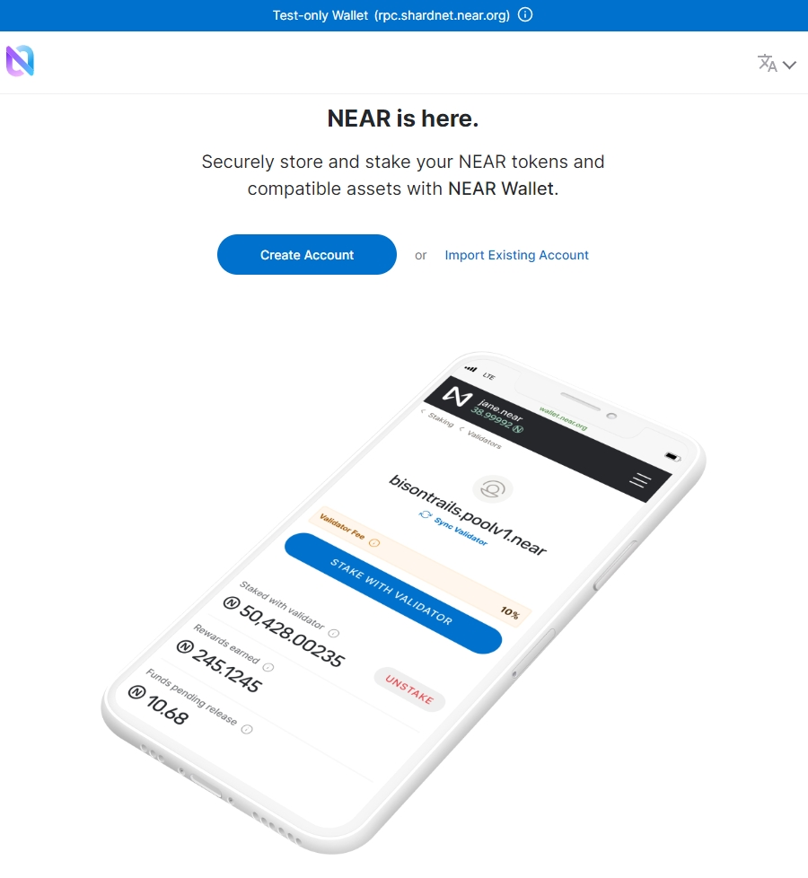
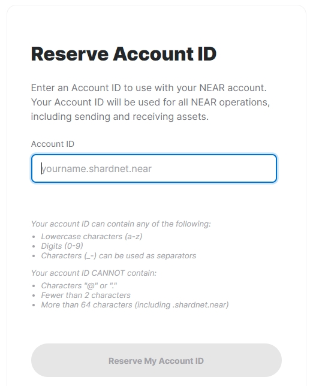
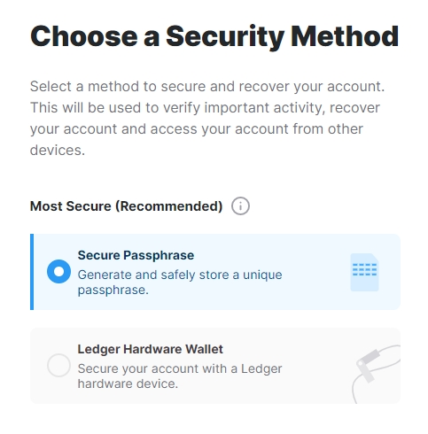
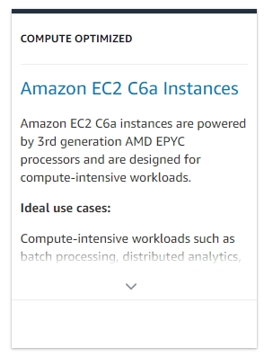
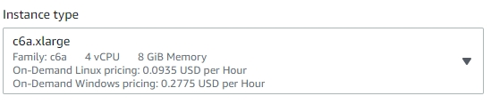
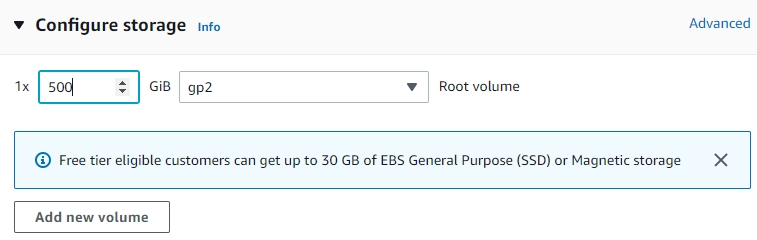
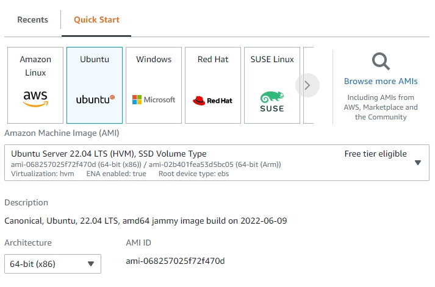
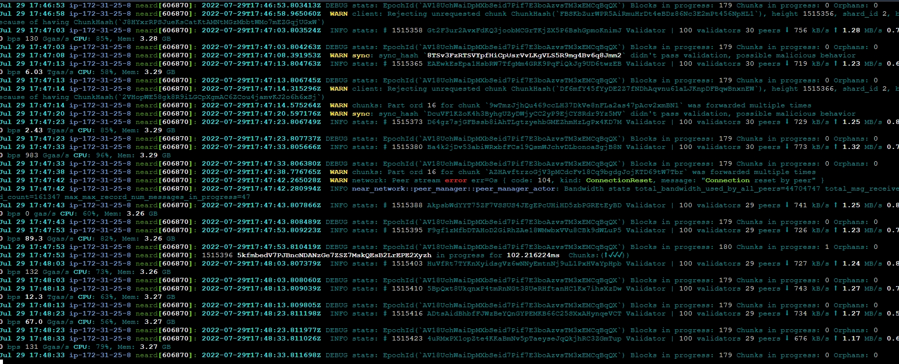
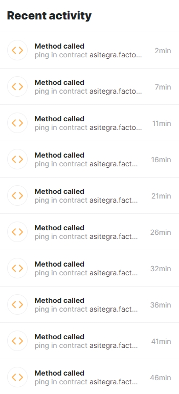
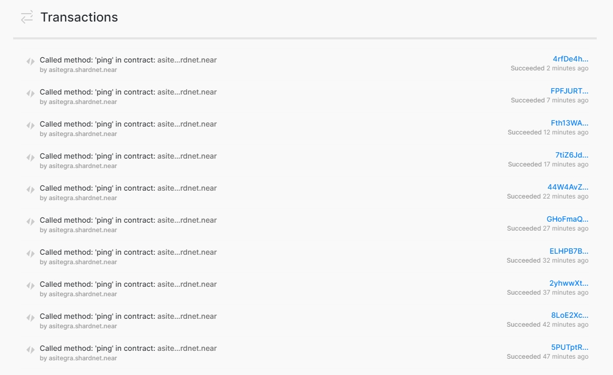

# Stake Wars: Episode III. Challenge 005
* Published on: 2022-07-30
* Updated on: 2022-07-29
* Submitted by: joetan79

# Setup a running validator node for shardnet on AWS cloud provider under EC2


## Create a wallet

Visit https://wallet.shardnet.near.org/ and click “Create account” 

 

then reserve your Account ID



and choose a security method among available options (Seed Phrase, Ledger, etc).



> NOTE!! For Seed Phrase make sure to write it down and keep in the safe place!

After completed you will log in to the wallet automatically.

---


## Get a host server

Please see the hardware requirement below:

| Hardware       | Chunk-Only Producer Server Specifications                             |
| -------------- | ---------------------------------------------------------------       |
| CPU            | 4-Core CPU with AVX support                                           |
| RAM            | 8GB DDR4                                                              |
| Storage        | 500GB SSD                                                             |

I have choosed AWS EC2 to host the server (https://aws.amazon.com/ec2/) and the deployed specification as below.

  

> The EC2 package allow to choose the capacity of the storage.



> And also it has various choice of operating system options:



> Recommended operating system of Linux will be Ubuntu or Debian. The operating system I have deployed was Ubuntu 22.04.

Once operating system is installed make sure the server is good for StakeWars and run the command below in console: 

```
lscpu | grep -P '(?=.*avx )(?=.*sse4.2 )(?=.*cx16 )(?=.*popcnt )' > /dev/null \
  && echo "Supported" \
  || echo "Not supported"
```

The result below was telling you fine!

```
 Supported
```
---


## Set up NEAR-CLI

In order to communicate with the NEAR blockchain via remote procedure calls (RPC) you should install NEAR-CLI.

Prior start the installation make sure the operating system is up-to-date:

```
sudo apt update && sudo apt upgrade -y
```

Then install developer tools of `Node.js` and `npm`:

```
curl -sL https://deb.nodesource.com/setup_18.x | sudo -E bash -  
sudo apt install build-essential nodejs
PATH="$PATH"
```

Check `Node.js` and `npm` versions after:

```
node -v
```

> it should be v18.x.x.

```
npm -v
```

> it should be v8.x.x.

Now you are all set and continue to install NEAR-CLI:

```
sudo npm install -g near-cli
```

Then you should set the environment variable to select the correct network:

```
export NEAR_ENV=shardnet
```

To keep it persistent we should set it as below:

```
echo 'export NEAR_ENV=shardnet' >> ~/.bashrc
source ~/.bashrc
```


See below some NEAR-CLI example of commands as reference.

```
near proposals
```

This shows a list of proposals by validators indicating they would like to enter the validator set. For a proposal to be accepted it must meet the minimum seat price. To see the seat price, please check [here](https://explorer.shardnet.near.org/nodes/validators).

```
near validators current
```
This shows a list of validators in the validator set currently, the number of expected and produced blocks and chunks, especially the online rate.

```
near validators next
```
This shows a list of validators with accepted proposals which will enter the validator set in the next epoch.

---

## Set up NEAR node

First of all please install required developer tools:

```
sudo apt install -y git binutils-dev libcurl4-openssl-dev zlib1g-dev libdw-dev libiberty-dev cmake gcc g++ python docker.io protobuf-compiler libssl-dev pkg-config clang llvm cargo
```

Next, install Python pip (the package installer for Python) and set the configuration:

```
sudo apt install python3-pip
USER_BASE_BIN=$(python3 -m site --user-base)/bin
export PATH="$USER_BASE_BIN:$PATH"
```

Then we have to install building environment:

```
sudo apt install clang build-essential make
```

Lastly, we install Rust & Cargo:

```
curl --proto '=https' --tlsv1.2 -sSf https://sh.rustup.rs | sh
```
> Press 1 when asked during installation

And make source the environment:

```
source $HOME/.cargo/env
```

Now it's time for us to clone `nearcore` repository from the GitHub:

```
git clone https://github.com/near/nearcore
cd ~/nearcore
git fetch
git checkout <commit>
```
> You can always find the current version of commit number in [this file](https://github.com/near/stakewars-iii/blob/main/commit.md) 

Then compile `nearcore` binary:

```
cargo build -p neard --release --features shardnet
```

NOTE: compiling `nearcore` binary can take some time, feel free to take some rest.

When it's done you should initialize working directory and get a couple of required configuration files:

```
./target/release/neard --home ~/.near init --chain-id shardnet --download-genesis
```

This command will create the directory structure and will generate `config.json`, `node_key.json`, and `genesis.json` on the network you have passed. 

- `config.json` - Configuration parameters which are responsive for how the node will work. The config.json contains needed information for a node to run on the network, how to communicate with peers, and how to reach consensus. Although some options are configurable. In general validators have opted to use the default config.json provided.

- `genesis.json` - A file with all the data the network started with at genesis. This contains initial accounts, contracts, access keys, and other records which represents the initial state of the blockchain. The genesis.json file is a snapshot of the network state at a point in time. In contacts accounts, balances, active validators, and other information about the network. 

- `node_key.json` -  A file which contains a public and private key for the node. Also includes an optional `account_id` parameter which is required to run a validator node (not covered in this doc).

- `data/` -  A folder in which a NEAR node will write it's state.

- Replace the `config.json`

From the generated `config.json`, there two parameters to modify:
- `boot_nodes`: If you had not specify the boot nodes, the generated `config.json` shows an empty array, so we will need to replace it with a full one specifying the boot nodes.
- `tracked_shards`: In the generated `config.json`, this field is an empty. You will have to replace it to `"tracked_shards": [0]`
```
rm ~/.near/config.json
wget -O ~/.near/config.json https://s3-us-west-1.amazonaws.com/build.nearprotocol.com/nearcore-deploy/shardnet/config.json
```

Then you can start NEAR node by simply running the following command:

```
cd ~/nearcore
./target/release/neard --home ~/.near run
```

In the other hand, in order to keep it running you should set systemd script:

```
sudo vi /etc/systemd/system/neard.service
```
paste

```
[Unit]
Description=NEARd Daemon Service

[Service]
Type=simple
User=<USER_PATH>
#Group=near
WorkingDirectory=/home/<USER_PATH>/.near
ExecStart=/home/<USER_PATH>/nearcore/target/release/neard run
Restart=on-failure
RestartSec=30
KillSignal=SIGINT
TimeoutStopSec=45
KillMode=mixed

[Install]
WantedBy=multi-user.target
```
> Make sure to change <USER_PATH> to your paths.

commands to enable and start the neard
``` 
sudo systemctl enable neard
sudo systemctl start neard
```

To see logs for your node you should run:

```
journalctl -n 100 -f -u neard | ccze -A
```
See below an example of log messages.

 

---

## Become a validator

You should run the following command to install full access key locally to sign transactions via NEAR-CLI:

```
near login
```

> Note: This command launches a web browser allowing for the authorization of a full access key to be copied locally. Otherwise just copy the link below to your browser.

 

then grant access to NEAR-CLI in opened window

 

and after pressing Enter in the console you should see this.


You need another configuration file **(validator_key.json)** by follow to create it.

```
near generate-key <pool_id>
```
> Feel free to replace pool_id with the pool name of your choice.

Then copy the generated key file to the validator directory:

```
cp ~/.near-credentials/shardnet/pool_id.json ~/.near/validator_key.json
```

Make the following changes in validator_key.json file:
* Set "xxxx.factory.shardnet.near" value (where xxxx is your pool name) to "account_id"
* Change "private_key" to "secret_key"

> Note: The account_id must match the staking pool contract's name you will create.

File content should look like that at the end:
```
{
  "account_id": "xxxx.factory.shardnet.near",
  "public_key": "ed25519:****",
  "secret_key": "ed25519:****"
}
```

Now continue with deploying staking pool and integrating it into the created node before. In order to do this you should run:

```
near call factory.shardnet.near create_staking_pool '{"staking_pool_id": "<pool id>", "owner_id": "<accountId>", "stake_public_key": "<public key>", "reward_fee_fraction": {"numerator": 5, "denominator": 100}, "code_hash":"DD428g9eqLL8fWUxv8QSpVFzyHi1Qd16P8ephYCTmMSZ"}' --accountId="<accountId>" --amount=30 --gas=300000000000000
```

where "pool id" is the name of pool you created, "accountId" is your Near wallet name and "public key" can be found in **validator_key.json** file stored in **.near** directory.

> Note: You should have at least 30 NEAR available on your Near wallet's balance.

You will see the result as below.


Congratulations! You finished a configuration of your staking pool so should be able to see it [the list of validators](https://explorer.shardnet.near.org/nodes/validators).

It should also appear in near proposals. 


Last but not least you should top up the balance of your pool to meet the minimum seat price (check it [here](https://explorer.shardnet.near.org/nodes/validators)).

```
near call <staking_pool_id> deposit_and_stake --amount <amount> --accountId <accountId> --gas=300000000000000
```

You can always check total and staked balance of you pool by running these commands:

##### Total Balance
```
near view <staking_pool_id> get_account_total_balance '{"account_id": "<accountId>"}'
```

##### Staked Balance
```
near view <staking_pool_id> get_account_staked_balance '{"account_id": "<accountId>"}'
```

If you decide to unstake and withdraw some or all tokens you should run:

##### Unstake NEAR
```
near call <staking_pool_id> unstake '{"amount": "<amount yoctoNEAR>"}' --accountId <accountId> --gas=300000000000000
```

To unstake all you can run this command instead:
```
near call <staking_pool_id> unstake_all --accountId <accountId> --gas=300000000000000
```

##### Withdraw

After 2-3 epochs after unstaking you can withdraw from the pool:

```
near call <staking_pool_id> withdraw '{"amount": "<amount yoctoNEAR>"}' --accountId <accountId> --gas=300000000000000
```

To withdraw all you can run this command instead:
```
near call <staking_pool_id> withdraw_all --accountId <accountId> --gas=300000000000000
```

> Unlike stake command amount in unstake and withdraw ones should be in yoctoNEAR (1 NEAR = 100,000,000 yoctoNEAR).

You can check unstaked and available for withdrawal balance of you pool this way:

##### Unstaked Balance
```
near view <staking_pool_id> get_account_unstaked_balance '{"account_id": "<accountId>"}'
```

##### Available for Withdrawal
```
near view <staking_pool_id> is_account_unstaked_balance_available '{"account_id": "<accountId>"}'
```
> It should be unlocked for you to be able to withdraw funds.

It's worth also mentioning that it's possible to pause staking:

```
near call <staking_pool_id> pause_staking '{}' --accountId <accountId>
```

and resume it later:

```
near call <staking_pool_id> resume_staking '{}' --accountId <accountId>
```

---

## Set up regular ping

In order to stay in the validator set you should ping to network.

You can do this manually:

```
near call <staking_pool_id> ping '{}' --accountId <accountId> --gas=300000000000000
```

However, alternatively, you can set up cron job to automate the process periodically.

Create **ping.sh** file in **/home/<USER_PATH>/scripts/** directory with the following content:

```
#!/bin/sh
# Ping call to renew Proposal added to crontab

export NEAR_ENV=shardnet
export LOGS=/home/<USER_PATH>/logs
export POOLID=<YOUR_POOL_ID>
export ACCOUNTID=<YOUR_ACCOUNT_ID>

echo "---" >> $LOGS/all.log
date >> $LOGS/all.log
near call $POOLID.factory.shardnet.near ping '{}' --accountId $ACCOUNTID.shardnet.near --gas=300000000000000 >> $LOGS/all.log
near proposals | grep $POOLID >> $LOGS/all.log
near validators current | grep $POOLID >> $LOGS/all.log
near validators next | grep $POOLID >> $LOGS/all.log
EOF
```

> Make sure to replace <USER_PATH>, <YOUR_POOL_ID> and <YOUR_ACCOUNT_ID> accordingly.

And then create crontab job by scheduling to run the script:(example below was 5 min)

```
crontab -e
*/5 * * * * sh /home/<USER_PATH>/scripts/ping.sh
```

You can check if job was created by reviewing a user's crontab:

```
crontab -l
```

and see log messages too:

```
cat home/<USER_PATH>/logs/all.log
```

in the meantime, you can see all transactions in Recent Activity of Near wallet.



or check it all in the explorer by click inside the 'View All' in the Near wallet.



---
